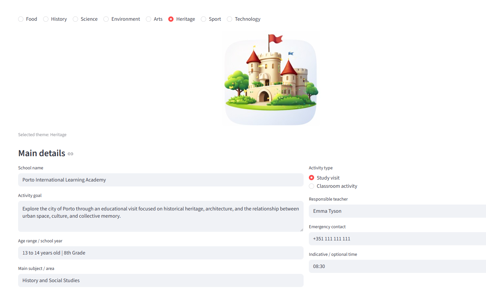
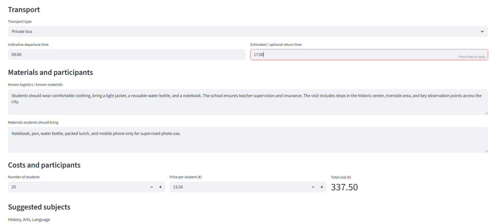
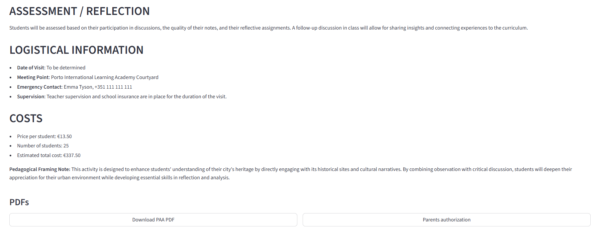

# EduPlan AI


EduPlan AI is an AI-powered platform designed to help teachers create structured educational plans in minutes.

---

## 🚀 What it does

- Generate educational plans using AI  
- Create visual banners for each activity  
- Generate PAA documents  
- Generate parent documents  
- Calculate costs  

---

## 📸 Demo

### Step 1: Define the activity


### Step 2: Generated plan


### Step 3: Materials and costs


### Step 4: Final output


---

## ⚙️ Installation

Clone the repo:

```bash
git clone https://github.com/your-username/eduplan-ai.git
cd eduplan-ai
```

Create environment:

```bash
python -m venv .venv
```

Activate:

```bash
.venv\Scripts\activate
```

Install:

```bash
pip install -r requirements.txt
```

---

## 🔐 API Key

Create a `.env` file:

```
OPENAI_API_KEY=your_api_key_here
```

Important:
- Do not upload `.env`
- Add it to `.gitignore`

---

## ▶️ Run

```bash
streamlit run app.py
```

Open:
```
http://localhost:8501
```

---

## 🌍 Features

- Multi-language (PT, EN, ES, FR)  
- AI-generated plans  
- PDF generation  
- Activity banners  

---

## 👤 Author

Valter Teixeira

---

## 📌 License

MIT